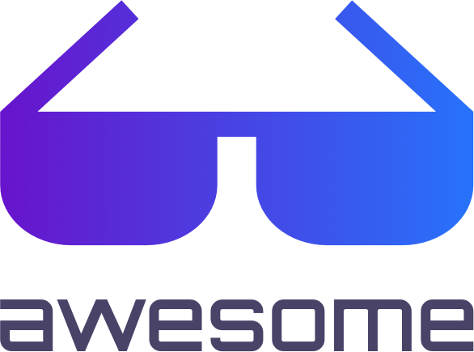

# Awesome Gradient

    

A curated list of awesome Gradient frameworks, libraries and software and resources

### Contents

- [Awesome Gradient](#awesome-gradient)
- [CSS](#css)
- [C#](#c#)
- [HTML](#html)
- [Java](#java)
- [JavaScript](#javascript)
- [Kotlin](#kotlin)
- [Objective-C](#objectivec)
- [Swift](#swift)
- [Vue](#vue)

## CSS

* [auroral](https://github.com/LunarLogic/auroral) - Animated background gradients with pure CSS.
* [nib](https://github.com/stylus/nib) - Stylus mixins, utilities, components, and gradient image generation.
* [webgradients](https://github.com/itmeo/webgradients) - A curated collection of splendid gradients made in CSS3, .sketch and .PSD formats.

## C#

* [CosineGradient](https://github.com/keijiro/CosineGradient) - Cosine gradient generator for Unity.
* [Unity-UIGradient](https://github.com/azixMcAze/Unity-UIGradient) - A UI gradient effect script for Unity.

## HTML

* [conic-gradient](https://github.com/LeaVerou/conic-gradient) - Polyfill for conic-gradient() and repeating-conic-gradient().
* [gradients](https://github.com/mrmrs/gradients) - Gradients!.
* [GradientTopographyAnimation](https://github.com/codrops/GradientTopographyAnimation) - Shape layers animation based on Polar Vector's work "Gradient Topography".
* [shade](https://github.com/jxnblk/shade) - Mathematically derived gradient explorer.

## Java

* [ahoy-onboarding](https://github.com/codemybrainsout/ahoy-onboarding) - Onboarding library for android with Gradient, Image or Solid color backgrounds.
* [AnimatedGradientTextView](https://github.com/Mursaat/AnimatedGradientTextView) - An Android TextView, using animated color gradients.
* [Ariana](https://github.com/akshay2211/Ariana) - Provide Multiple Gradients in ImageViews and Texts. Integrate with ViewPager to change colors dynamically.
* [Gradient-Artist](https://github.com/Hariofspades/Gradient-Artist) - Learning to create Android UI library.
* [GradientDrawableTuner](https://github.com/duanhong169/GradientDrawableTuner) - See how the properties of Android's "shape" affect the Drawable's appearance, intuitively.
* [GradientLayout](https://github.com/csdodd/GradientLayout) - A library which extends Android layouts to allow for the easy configuring of gradient backgrounds.
* [MusicWave](https://github.com/akshay2211/MusicWave) - With MusicWave represent your Sound in a gradient colored Visualization.
* [ProgressRoundButton](https://github.com/cctanfujun/ProgressRoundButton) - A DownloadProgressButton with Animation for Android.

## JavaScript

* [colorful-background-css-generator](https://github.com/webcore-it/colorful-background-css-generator) - A colorful css gradient background generator.
* [coolhue](https://github.com/webkul/coolhue) - Coolest Gradient Hues and Swatches.
* [grabient](https://github.com/johnkorzhuk/grabient) - UI to generate linear-gradients.
* [grade](https://github.com/benhowdle89/grade) - This JavaScript library produces complementary gradients generated from the top 2 dominant colours in supplied images.
* [gradient-string](https://github.com/bokub/gradient-string) - Beautiful color gradients in terminal output.
* [granim.js](https://github.com/sarcadass/granim.js) - Create fluid and interactive gradients animations with this small (< 17 kB) js library.
* [hyperborder](https://github.com/webmatze/hyperborder) - Adds a gradient border to the Hyper terminal.
* [postcss-easing-gradients](https://github.com/larsenwork/postcss-easing-gradients) - PostCSS plugin to create smooth linear-gradients that approximate easing functions.
* [react-native-gradient-buttons](https://github.com/thomaswangio/react-native-gradient-buttons) - A lightweight, customizable and haptic Gradient Button component library for React Native.
* [react-native-login](https://github.com/brentvatne/react-native-login) - React-native login via native facebook sdk, with a mp4 video background and a linear gradient.
* [react-native-svg-animated-linear-gradient](https://github.com/virusvn/react-native-svg-animated-linear-gradient) - A wrap SVG component for animated linear gradient.
* [sketch-palettes](https://github.com/andrewfiorillo/sketch-palettes) - A Sketch plugin for exporting and importing fill presets. It supports colors, gradients, and pattern fills.
* [tinygradient](https://github.com/mistic100/tinygradient) - Fast and small gradients manipulation, built on top of TinyColor.

## Kotlin

* [AvatarView](https://github.com/vitorhugods/AvatarView) - A circular Image View with a lot of perks. Including progress animation and highlight state with borders and gradient color.
* [co.revely.gradient](https://github.com/revely-inc/co.revely.gradient) - An Android library for easy gradient management.
* [Gradients](https://github.com/bakhtiyork/gradients) - A curated collection of splendid gradients (port of https://webgradients.com for Android)
* [Spark](https://github.com/TonnyL/Spark) - An Android library to create gradient animation like Instagram&Spotify.

## Objective-C

* [OCSkeleton](https://github.com/mayqiyue/OCSkeleton) - Make your loading view a little difference.

## Swift

* [AEConicalGradient](https://github.com/tadija/AEConicalGradient) - Conical (angular) gradient for iOS.
* [AnimatedMaskLabel](https://github.com/jogendra/AnimatedMaskLabel) - A nice gradient animated label that make easy to add a shimmering effect to any view.
* [ComplimentaryGradientView](https://github.com/gkye/ComplimentaryGradientView) - Create complementary gradients generated from dominant and prominent colors in supplied image.
* [DSGradientProgressView](https://github.com/DholStudio/DSGradientProgressView) - A simple animated progress bar in Swift.
* [EZYGradientView](https://github.com/shashankpali/EZYGradientView) - Create gradients and blur gradients without a single line of code.
* [GradientCircularProgress](https://github.com/keygx/GradientCircularProgress) - Customizable progress indicator library.
* [GradientLoadingBar](https://github.com/fxm90/GradientLoadingBar) - A customizable animated gradient loading bar.
* [GradientProgressBar](https://github.com/fxm90/GradientProgressBar) - A customizable gradient progress bar (UIProgressView).
* [Gradients](https://github.com/cruisediary/Gradients) - A curated collection of splendid 180+ gradients made.
* [GradientSlider](https://github.com/jonhull/GradientSlider) - GradientSlider is a UIControl subclass which is similar to UISlider, but with a linear gradient coloring the slider’s track. Useful for creating color pickers.
* [GradientView](https://github.com/soffes/GradientView) - Easily use gradients in UIKit for iOS & tvOS.
* [Hue](https://github.com/hyperoslo/Hue) - Hue is the all-in-one coloring utility that you'll ever need.
* [KDCircularProgress](https://github.com/kaandedeoglu/KDCircularProgress) - A circular progress view with gradients written in Swift.
* [MKGradientView](https://github.com/maxkonovalov/MKGradientView) - Highly customizable Core Graphics based gradient view for iOS.
* [Pastel](https://github.com/cruisediary/Pastel) - Gradient animation effect like Instagram.
* [Shift](https://github.com/kgellci/Shift) - Animate gradient changes with time or motion for iOS.
* [Skeleton](https://github.com/gonzalonunez/Skeleton) - An easy way to create sliding CAGradientLayer animations.
* [Tamamushi](https://github.com/makomori/Tamamushi) - Gradient NavigationBar library.
* [UIGradient](https://github.com/dqhieu/UIGradient) - A simple and powerful library for using gradient layer, image, color.

## Vue

* [uiGradients](https://github.com/ghosh/uiGradients) - Beautiful colour gradients for design and code.
